# Hi, I'm Maaz 👋

🚀 Aspiring AI Engineer | 2 Android Apps on Play Store | Learning Python, LLMs & RAG | Open to Internships| CS Student @ NUML, Pakistan

---

## 📱 Published Apps (Google Play Store)

| App | Downloads | Rating | Highlights |
|-----|-----------|--------|------------|
| [Prayer Times, Azan & Adhkar](https://play.google.com/store/apps/details?id=com.maazinex.prayer_time_azan_qibla_finder) | 1299+ | 4.5 ⭐ | 3 languages (EN/UR/AR), Qibla finder, Daily Adhkar |
| [GPA & CGPA Calculator](https://play.google.com/store/apps/details?id=com.maazinex.pakistani_gpa_calculator) | Active | 5.0 ⭐ | 50+ Pakistani universities |

### 📸 App Screenshots

**Prayer Times, Azan & Adhkar**

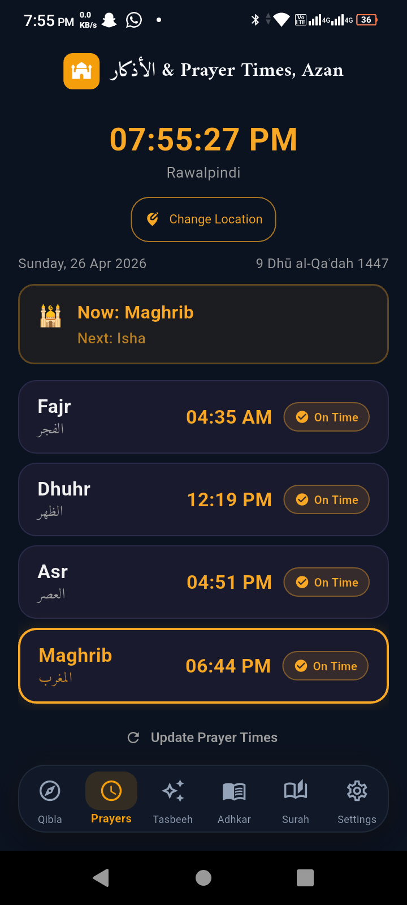 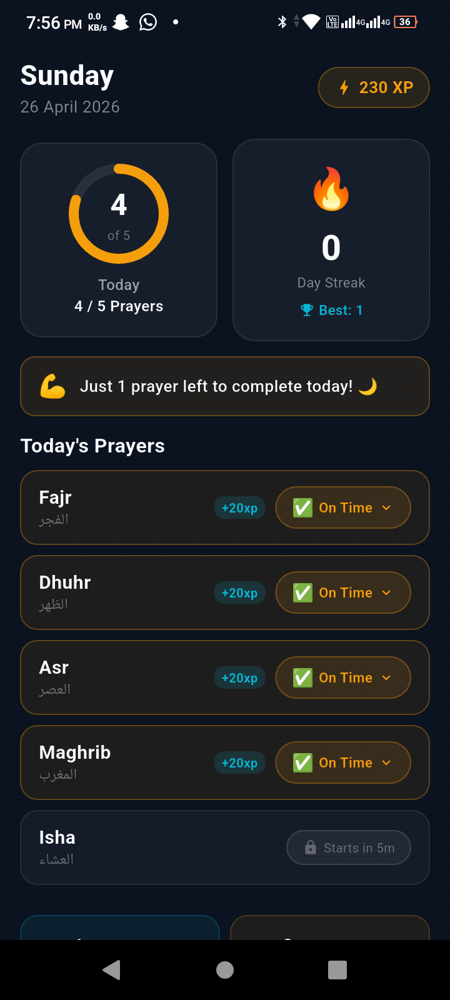 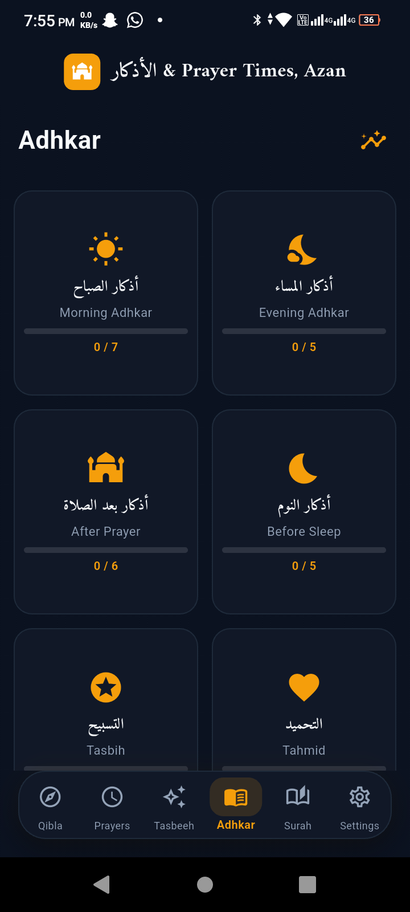
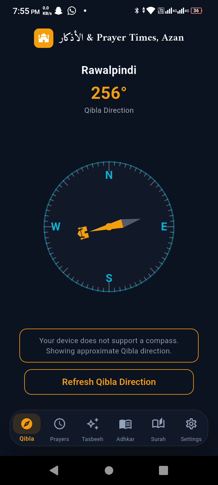
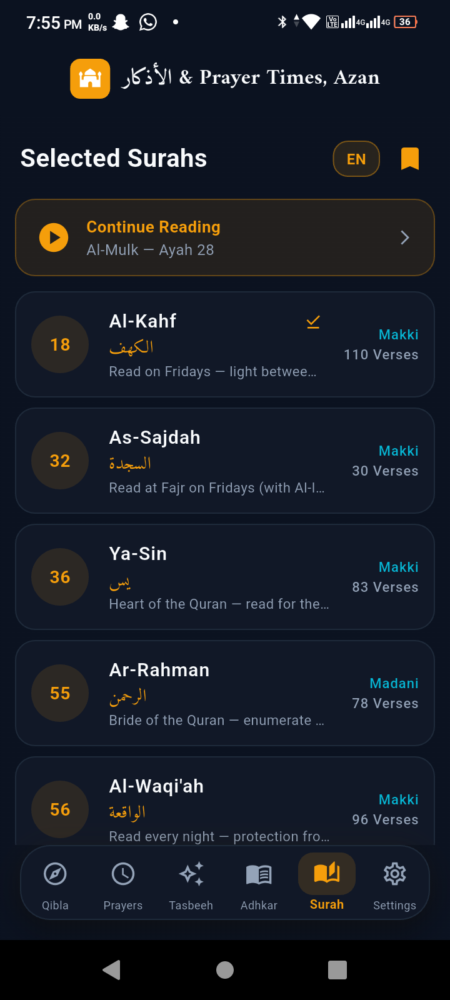

**GPA & CGPA Calculator**

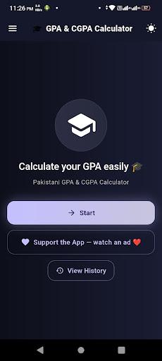 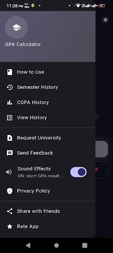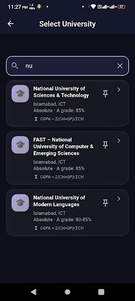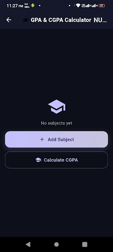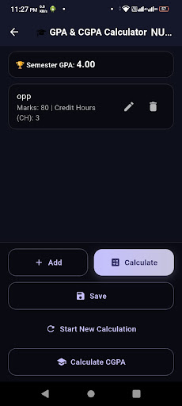 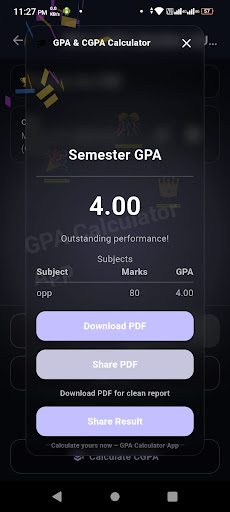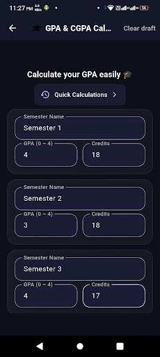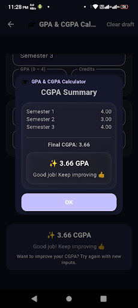

# Hi, I'm Maaz 👋

🤖 AI Engineer | Building LLM Apps, Agentic Systems & AI Tools  
📍 Rawalpindi / Islamabad, Pakistan  
🎓 CS Student @ NUML Islamabad | Open to Remote AI Internships

---

## 🚀 What I Build

| Project | Tech | Description |
|---------|------|-------------|
| [LangGraph Agentic RAG](https://github.com/MaazzAlii/langchain-agentic-vision-rag) | LangGraph · Mistral AI · ChromaDB | Chat with any PDF using Vision AI + 4-DB agent |
| [Multi-Agent AI System](https://github.com/MaazzAlii/orchestr-ai) | LangGraph · Mistral AI | Researcher + Writer + Reviewer agents pipeline |
| [AI Voice Assistant](https://github.com/MaazzAlii/ai-voice-chatbot-python) | Python · Mistral AI · Web Speech | Speak to AI, it thinks and talks back |
| [AI Context Saver](https://github.com/MaazzAlii/context-saver-extension) | JavaScript · Chrome APIs · Mistral AI | Save & compress AI chats by 90% |
| [HabitFlow](https://github.com/MaazzAlii/habitflow-devweekends) | MERN · Mistral AI | AI productivity coach + habit tracker |
| [GB Tourism FYP](https://github.com/MaazzAlii/gb-tourism-fyp) | FastAPI · ReactJS · Flutter | AI-assisted booking platform |

---

## 🛠️ Tech Stack

**AI/LLM:** LangGraph · RAG · ChromaDB · Mistral AI · Ollama · Streamlit  
**Backend:** FastAPI · Python · Node.js · REST APIs · JWT  
**Frontend:** ReactJS · JavaScript · HTML/CSS  
**Mobile:** Flutter · Dart · Google Play Store (2 published apps)  
**Tools:** Git · GitHub · VS Code · Cursor AI

---

## 📊 Building in Public — 100 Days of AI

🔗 [LinkedIn](https://linkedin.com/in/maazzalii) · 
📧 maazalishahid@gmail.com

---

## 🔗 Connect

- LinkedIn: [linkedin.com/in/maaz-alii](https://www.linkedin.com/in/maazzalii/)
